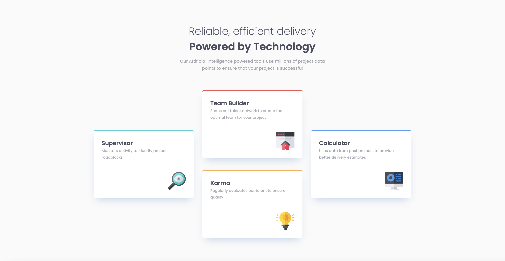

# Four card feature section solution

This is a solution to the [Four card feature section challenge on Frontend Mentor](https://www.frontendmentor.io/challenges/four-card-feature-section-weK1eFYK).

## Table of contents

- [Overview](#overview)
  - [The challenge](#the-challenge)
  - [Screenshot](#screenshot)
  - [Links](#links)
- [My process](#my-process)
  - [Built with](#built-with)
  - [What I learned](#what-i-learned)
  - [Continued development](#continued-development)
- [Author](#author)

## Overview

### The challenge

Users should be able to:

- View the optimal layout for the site depending on their device's screen size

### Screenshot

### Links

- [Solution on frontendmentor.io](https://www.frontendmentor.io/solutions/four-card-feature-section-ZJGuLctJNp)
- [Live preview](https://piwkoo.github.io/four-card-feature-section/)

## My process

### Built with

- Semantic HTML5 markup
- CSS custom properties
- CSS Grid
- Mobile-first workflow
- OOCSS methodology

### What I learned

This was an interesting project when it comes to card positioning. I decided to go with CSS Grid because of *grid-template* and *grid-area* properties. I improved skills responsible for decision-making before starting a project. I believe I went with optimal approach to this project, but how knows, maybe I'll give it another thought after some time pass.

### Continued development

I definitely want to use more of CSS Grid in my project. When I'll see that it's a good fit, I want to use this tool as much as I can to get a better understanding then I have at this moment.

## Author

- Github - [@PiwkoO](https://github.com/PiwkoO)
- Frontend Mentor - [@PiwkoO](https://www.frontendmentor.io/profile/PiwkoO)
